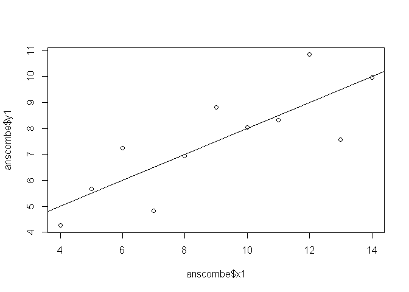
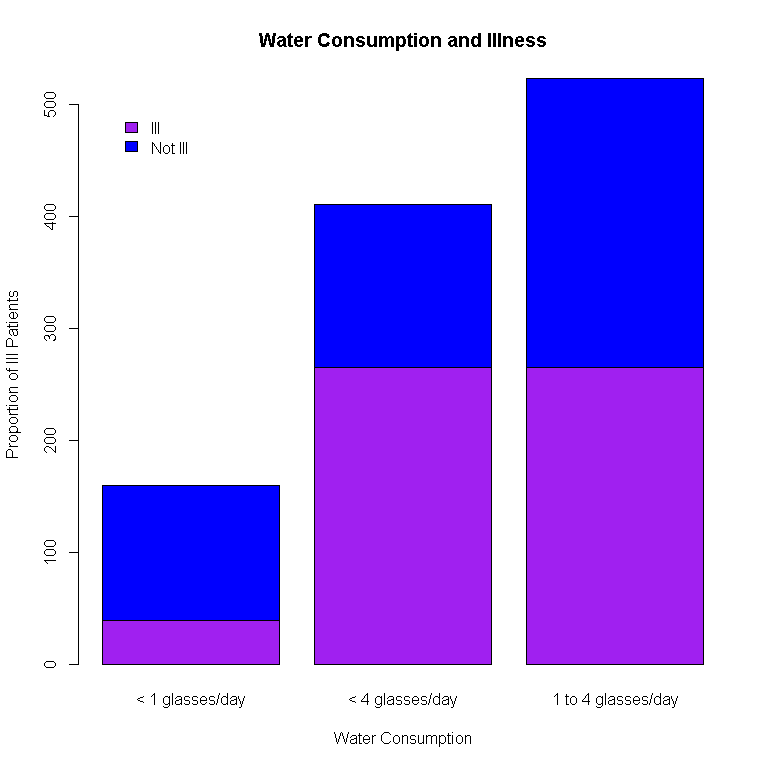
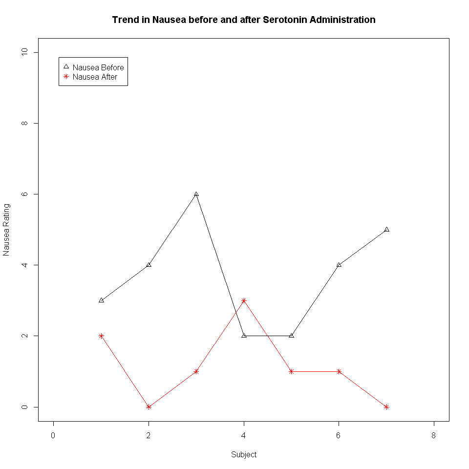

Assignment 1
================
Carey Hedges (751546)
11 July 2016

R Markdown
----------

"I love Octocat. She's the coolest cat in town"


Assignment 2
------------

``` r
data (anscombe)
dim (anscombe)
```

    ## [1] 11  8

``` r
colnames (anscombe)
```

    ## [1] "x1" "x2" "x3" "x4" "y1" "y2" "y3" "y4"

``` r
head (anscombe)
```

    ##   x1 x2 x3 x4   y1   y2    y3   y4
    ## 1 10 10 10  8 8.04 9.14  7.46 6.58
    ## 2  8  8  8  8 6.95 8.14  6.77 5.76
    ## 3 13 13 13  8 7.58 8.74 12.74 7.71
    ## 4  9  9  9  8 8.81 8.77  7.11 8.84
    ## 5 11 11 11  8 8.33 9.26  7.81 8.47
    ## 6 14 14 14  8 9.96 8.10  8.84 7.04

``` r
tail (anscombe)
```

    ##    x1 x2 x3 x4    y1   y2   y3    y4
    ## 6  14 14 14  8  9.96 8.10 8.84  7.04
    ## 7   6  6  6  8  7.24 6.13 6.08  5.25
    ## 8   4  4  4 19  4.26 3.10 5.39 12.50
    ## 9  12 12 12  8 10.84 9.13 8.15  5.56
    ## 10  7  7  7  8  4.82 7.26 6.42  7.91
    ## 11  5  5  5  8  5.68 4.74 5.73  6.89

``` r
summary (anscombe)
```

    ##        x1             x2             x3             x4    
    ##  Min.   : 4.0   Min.   : 4.0   Min.   : 4.0   Min.   : 8  
    ##  1st Qu.: 6.5   1st Qu.: 6.5   1st Qu.: 6.5   1st Qu.: 8  
    ##  Median : 9.0   Median : 9.0   Median : 9.0   Median : 8  
    ##  Mean   : 9.0   Mean   : 9.0   Mean   : 9.0   Mean   : 9  
    ##  3rd Qu.:11.5   3rd Qu.:11.5   3rd Qu.:11.5   3rd Qu.: 8  
    ##  Max.   :14.0   Max.   :14.0   Max.   :14.0   Max.   :19  
    ##        y1               y2              y3              y4        
    ##  Min.   : 4.260   Min.   :3.100   Min.   : 5.39   Min.   : 5.250  
    ##  1st Qu.: 6.315   1st Qu.:6.695   1st Qu.: 6.25   1st Qu.: 6.170  
    ##  Median : 7.580   Median :8.140   Median : 7.11   Median : 7.040  
    ##  Mean   : 7.501   Mean   :7.501   Mean   : 7.50   Mean   : 7.501  
    ##  3rd Qu.: 8.570   3rd Qu.:8.950   3rd Qu.: 7.98   3rd Qu.: 8.190  
    ##  Max.   :10.840   Max.   :9.260   Max.   :12.74   Max.   :12.500

Assignment 3
------------



Assignment 4
------------

### Code Chunk 4

``` r
df <- read.csv('analgesic.csv')
```

### Code Chunk 5

``` r
dim (df)
```

    ## [1] 40  5

``` r
colnames (df)
```

    ## [1] "ID"            "Group"         "Measurement_1" "Measurement_2"
    ## [5] "Measurement_3"

``` r
head (df)
```

    ##   ID     Group Measurement_1 Measurement_2 Measurement_3
    ## 1  1 Analgesic            26            26            21
    ## 2  2 Analgesic            29            26            23
    ## 3  3 Analgesic            24            28            22
    ## 4  4 Analgesic            25            22            24
    ## 5  5 Analgesic            24            28            23
    ## 6  6 Analgesic            22            23            26

``` r
tail (df)
```

    ##    ID   Group Measurement_1 Measurement_2 Measurement_3
    ## 35 35 Placebo            17            21            15
    ## 36 36 Placebo            19            17            15
    ## 37 37 Placebo            14            19            13
    ## 38 38 Placebo            17            19            13
    ## 39 39 Placebo            11            20            18
    ## 40 40 Placebo            15            18            12

``` r
summary (df)
```

    ##        ID              Group    Measurement_1   Measurement_2 
    ##  Min.   : 1.00   Analgesic:20   Min.   :10.00   Min.   : 8.0  
    ##  1st Qu.:10.75   Placebo  :20   1st Qu.:17.00   1st Qu.:17.0  
    ##  Median :20.50                  Median :20.00   Median :20.0  
    ##  Mean   :20.50                  Mean   :20.12   Mean   :20.7  
    ##  3rd Qu.:30.25                  3rd Qu.:24.00   3rd Qu.:25.0  
    ##  Max.   :40.00                  Max.   :30.00   Max.   :32.0  
    ##  Measurement_3  
    ##  Min.   :12.00  
    ##  1st Qu.:16.00  
    ##  Median :20.50  
    ##  Mean   :20.52  
    ##  3rd Qu.:24.25  
    ##  Max.   :30.00

### Code Chunk 6

``` r
library(tidyr)
```

    ## Warning: package 'tidyr' was built under R version 3.3.1

``` r
library(dplyr)
```

    ## Warning: package 'dplyr' was built under R version 3.3.1

    ## 
    ## Attaching package: 'dplyr'

    ## The following objects are masked from 'package:stats':
    ## 
    ##     filter, lag

    ## The following objects are masked from 'package:base':
    ## 
    ##     intersect, setdiff, setequal, union

``` r
df2 <- gather(df,"Measurement", "Value", Measurement_1:Measurement_3) #Change wide to long
df2
```

    ##     ID     Group   Measurement Value
    ## 1    1 Analgesic Measurement_1    26
    ## 2    2 Analgesic Measurement_1    29
    ## 3    3 Analgesic Measurement_1    24
    ## 4    4 Analgesic Measurement_1    25
    ## 5    5 Analgesic Measurement_1    24
    ## 6    6 Analgesic Measurement_1    22
    ## 7    7 Analgesic Measurement_1    25
    ## 8    8 Analgesic Measurement_1    28
    ## 9    9 Analgesic Measurement_1    22
    ## 10  10 Analgesic Measurement_1    18
    ## 11  11 Analgesic Measurement_1    25
    ## 12  12 Analgesic Measurement_1    26
    ## 13  13 Analgesic Measurement_1    26
    ## 14  14 Analgesic Measurement_1    19
    ## 15  15 Analgesic Measurement_1    24
    ## 16  16 Analgesic Measurement_1    23
    ## 17  17 Analgesic Measurement_1    24
    ## 18  18 Analgesic Measurement_1    24
    ## 19  19 Analgesic Measurement_1    23
    ## 20  20 Analgesic Measurement_1    30
    ## 21  21   Placebo Measurement_1    19
    ## 22  22   Placebo Measurement_1    10
    ## 23  23   Placebo Measurement_1    12
    ## 24  24   Placebo Measurement_1    17
    ## 25  25   Placebo Measurement_1    18
    ## 26  26   Placebo Measurement_1    12
    ## 27  27   Placebo Measurement_1    14
    ## 28  28   Placebo Measurement_1    20
    ## 29  29   Placebo Measurement_1    16
    ## 30  30   Placebo Measurement_1    17
    ## 31  31   Placebo Measurement_1    18
    ## 32  32   Placebo Measurement_1    20
    ## 33  33   Placebo Measurement_1    12
    ## 34  34   Placebo Measurement_1    20
    ## 35  35   Placebo Measurement_1    17
    ## 36  36   Placebo Measurement_1    19
    ## 37  37   Placebo Measurement_1    14
    ## 38  38   Placebo Measurement_1    17
    ## 39  39   Placebo Measurement_1    11
    ## 40  40   Placebo Measurement_1    15
    ## 41   1 Analgesic Measurement_2    26
    ## 42   2 Analgesic Measurement_2    26
    ## 43   3 Analgesic Measurement_2    28
    ## 44   4 Analgesic Measurement_2    22
    ## 45   5 Analgesic Measurement_2    28
    ## 46   6 Analgesic Measurement_2    23
    ## 47   7 Analgesic Measurement_2    25
    ## 48   8 Analgesic Measurement_2    21
    ## 49   9 Analgesic Measurement_2    26
    ## 50  10 Analgesic Measurement_2    25
    ## 51  11 Analgesic Measurement_2    29
    ## 52  12 Analgesic Measurement_2    25
    ## 53  13 Analgesic Measurement_2    25
    ## 54  14 Analgesic Measurement_2    30
    ## 55  15 Analgesic Measurement_2    20
    ## 56  16 Analgesic Measurement_2    24
    ## 57  17 Analgesic Measurement_2    32
    ## 58  18 Analgesic Measurement_2    17
    ## 59  19 Analgesic Measurement_2    25
    ## 60  20 Analgesic Measurement_2    18
    ## 61  21   Placebo Measurement_2    12
    ## 62  22   Placebo Measurement_2    16
    ## 63  23   Placebo Measurement_2    11
    ## 64  24   Placebo Measurement_2    17
    ## 65  25   Placebo Measurement_2    18
    ## 66  26   Placebo Measurement_2    16
    ## 67  27   Placebo Measurement_2    17
    ## 68  28   Placebo Measurement_2    19
    ## 69  29   Placebo Measurement_2    19
    ## 70  30   Placebo Measurement_2    15
    ## 71  31   Placebo Measurement_2    21
    ## 72  32   Placebo Measurement_2    13
    ## 73  33   Placebo Measurement_2     8
    ## 74  34   Placebo Measurement_2    17
    ## 75  35   Placebo Measurement_2    21
    ## 76  36   Placebo Measurement_2    17
    ## 77  37   Placebo Measurement_2    19
    ## 78  38   Placebo Measurement_2    19
    ## 79  39   Placebo Measurement_2    20
    ## 80  40   Placebo Measurement_2    18
    ## 81   1 Analgesic Measurement_3    21
    ## 82   2 Analgesic Measurement_3    23
    ## 83   3 Analgesic Measurement_3    22
    ## 84   4 Analgesic Measurement_3    24
    ## 85   5 Analgesic Measurement_3    23
    ## 86   6 Analgesic Measurement_3    26
    ## 87   7 Analgesic Measurement_3    30
    ## 88   8 Analgesic Measurement_3    21
    ## 89   9 Analgesic Measurement_3    20
    ## 90  10 Analgesic Measurement_3    29
    ## 91  11 Analgesic Measurement_3    28
    ## 92  12 Analgesic Measurement_3    23
    ## 93  13 Analgesic Measurement_3    26
    ## 94  14 Analgesic Measurement_3    27
    ## 95  15 Analgesic Measurement_3    24
    ## 96  16 Analgesic Measurement_3    27
    ## 97  17 Analgesic Measurement_3    28
    ## 98  18 Analgesic Measurement_3    25
    ## 99  19 Analgesic Measurement_3    23
    ## 100 20 Analgesic Measurement_3    25
    ## 101 21   Placebo Measurement_3    18
    ## 102 22   Placebo Measurement_3    18
    ## 103 23   Placebo Measurement_3    20
    ## 104 24   Placebo Measurement_3    18
    ## 105 25   Placebo Measurement_3    20
    ## 106 26   Placebo Measurement_3    16
    ## 107 27   Placebo Measurement_3    17
    ## 108 28   Placebo Measurement_3    18
    ## 109 29   Placebo Measurement_3    15
    ## 110 30   Placebo Measurement_3    13
    ## 111 31   Placebo Measurement_3    14
    ## 112 32   Placebo Measurement_3    16
    ## 113 33   Placebo Measurement_3    21
    ## 114 34   Placebo Measurement_3    16
    ## 115 35   Placebo Measurement_3    15
    ## 116 36   Placebo Measurement_3    15
    ## 117 37   Placebo Measurement_3    13
    ## 118 38   Placebo Measurement_3    13
    ## 119 39   Placebo Measurement_3    18
    ## 120 40   Placebo Measurement_3    12

``` r
df3 <- group_by (df2, Group) #Group by Placebo and Analgesic
df3
```

    ## Source: local data frame [120 x 4]
    ## Groups: Group [2]
    ## 
    ##       ID     Group   Measurement Value
    ##    (int)    (fctr)         (chr) (int)
    ## 1      1 Analgesic Measurement_1    26
    ## 2      2 Analgesic Measurement_1    29
    ## 3      3 Analgesic Measurement_1    24
    ## 4      4 Analgesic Measurement_1    25
    ## 5      5 Analgesic Measurement_1    24
    ## 6      6 Analgesic Measurement_1    22
    ## 7      7 Analgesic Measurement_1    25
    ## 8      8 Analgesic Measurement_1    28
    ## 9      9 Analgesic Measurement_1    22
    ## 10    10 Analgesic Measurement_1    18
    ## ..   ...       ...           ...   ...

``` r
df4 <- group_by (df3, ID) #Read by ID
df4
```

    ## Source: local data frame [120 x 4]
    ## Groups: ID [40]
    ## 
    ##       ID     Group   Measurement Value
    ##    (int)    (fctr)         (chr) (int)
    ## 1      1 Analgesic Measurement_1    26
    ## 2      2 Analgesic Measurement_1    29
    ## 3      3 Analgesic Measurement_1    24
    ## 4      4 Analgesic Measurement_1    25
    ## 5      5 Analgesic Measurement_1    24
    ## 6      6 Analgesic Measurement_1    22
    ## 7      7 Analgesic Measurement_1    25
    ## 8      8 Analgesic Measurement_1    28
    ## 9      9 Analgesic Measurement_1    22
    ## 10    10 Analgesic Measurement_1    18
    ## ..   ...       ...           ...   ...

``` r
summarise (df4, mean(Value)) #Mean of all replicates
```

    ## Source: local data frame [40 x 2]
    ## 
    ##       ID mean(Value)
    ##    (int)       (dbl)
    ## 1      1    24.33333
    ## 2      2    26.00000
    ## 3      3    24.66667
    ## 4      4    23.66667
    ## 5      5    25.00000
    ## 6      6    23.66667
    ## 7      7    26.66667
    ## 8      8    23.33333
    ## 9      9    22.66667
    ## 10    10    24.00000
    ## ..   ...         ...

Assignment 5
============

Question 1 - Chicken Weights
----------------------------

Ho: Chicken feed has no effect on the rate of chicken growth. H1: Chicken feed has an effect on the rate of chicken growth.

In order to evaluate this claim, an ANOVA will need to be used with a posthoc pairwise t-test to evaluate which chicken feed are better for plumper chickens.

This test assumes that the data are parametric and that there are greater than 3 groups.

``` r
library (dplyr)
library (tidyr)
library (knitr)

cw <- read.csv ("C:/Users/Carey Hedges/Desktop/Assignment 4 - Stats/chick-weights.csv") #Read Excel Doc and look at data
head(cw)
```

    ##   weight      feed
    ## 1    179 horsebean
    ## 2    160 horsebean
    ## 3    136 horsebean
    ## 4    227 horsebean
    ## 5    217 horsebean
    ## 6    168 horsebean

``` r
colnames(cw)
```

    ## [1] "weight" "feed"

``` r
dim (cw)
```

    ## [1] 71  2

``` r
boxplot (weight~feed, data = cw, col = "red", xlab = 'Feed', ylab = 'Chicken Weight', main= "Boxplots of Chicken Weights versus Feed")
```


``` r
cw2 <- aov(weight~feed, data = cw) #Assign test to variable to allow for summary analysis
summary (cw2)
```

    ##             Df Sum Sq Mean Sq F value   Pr(>F)    
    ## feed         5 231129   46226   15.37 5.94e-10 ***
    ## Residuals   65 195556    3009                     
    ## ---
    ## Signif. codes:  0 '***' 0.001 '**' 0.01 '*' 0.05 '.' 0.1 ' ' 1

``` r
pairwise.t.test (chickwts$weight, chickwts$feed, p.adjust.method = 'holm', paired =FALSE) #Always posthoc test for groups
```

    ## 
    ##  Pairwise comparisons using t tests with pooled SD 
    ## 
    ## data:  chickwts$weight and chickwts$feed 
    ## 
    ##           casein  horsebean linseed meatmeal soybean
    ## horsebean 2.9e-08 -         -       -        -      
    ## linseed   0.00016 0.09435   -       -        -      
    ## meatmeal  0.18227 9.0e-05   0.09435 -        -      
    ## soybean   0.00532 0.00298   0.51766 0.51766  -      
    ## sunflower 0.81249 1.2e-08   8.1e-05 0.13218  0.00298
    ## 
    ## P value adjustment method: holm

The anova suggests that the feed affects the rate of chicken growth F(2,65) = 15.37, p&lt;0.001.

The posthoc test indicates that there is a significant difference between different types of feed. Casein and Sunflower feed are comparible in increasing rate of chicken growth. Casein and Sunflower feed is slightly more effective than meatmeal for increase rate of chicken growth. Meatmeal is only slightly more effective than linseed and soybean at increasing rate of chicken growth. The least effective for increasing the rate of chicken growth is Horsebean feed. (Refer to pairwise t.test for test statistics).

Question 2 - The Heat Zone
--------------------------

Ho: Gastroenteritis is not caused by contaminated water. H1: Gastroenteritis could be caused by contaminated water.

A Chi-squared analysis is necessary to establish if there is a difference in water consumption and illness.

The assumptions that underpin this test are:

1.  Values are independent of one another
2.  Sampling is random
3.  Observed frequencies are approximated by normal distribution
4.  Expected values should be 5 in 80% of the cells

``` r
library (dplyr)
library (tidyr)
library (knitr)
library (ggplot2)
```

    ## Warning: package 'ggplot2' was built under R version 3.3.1

``` r
gi <- read.csv ("C:/Users/Carey Hedges/Desktop/Assignment 4 - Stats/gastroenteritis.csv")# Read excel document in order to work with data in R Studio
summary(gi)
```

    ##              Consumption     Outcome   
    ##  < 1 glasses/day   :160   ill    :569  
    ##  < 4 glasses/day   :411   not ill:525  
    ##  1 to 4 glasses/day:523

``` r
head(gi)
```

    ##       Consumption Outcome
    ## 1 < 1 glasses/day     ill
    ## 2 < 1 glasses/day     ill
    ## 3 < 1 glasses/day     ill
    ## 4 < 1 glasses/day     ill
    ## 5 < 1 glasses/day     ill
    ## 6 < 1 glasses/day     ill

``` r
tail(gi)
```

    ##          Consumption Outcome
    ## 1089 < 4 glasses/day not ill
    ## 1090 < 4 glasses/day not ill
    ## 1091 < 4 glasses/day not ill
    ## 1092 < 4 glasses/day not ill
    ## 1093 < 4 glasses/day not ill
    ## 1094 < 4 glasses/day not ill

``` r
gi2 <- table(gi$Outcome, gi$Consumption) #Cross Tabulate the data
gi2
```

    ##          
    ##           < 1 glasses/day < 4 glasses/day 1 to 4 glasses/day
    ##   ill                  39             265                265
    ##   not ill             121             146                258

``` r
barplot (gi2, col = c("purple", "blue"), main = "Water Consumption and Illness", xlab = "Water Consumption", ylab = "Proportion of Ill Patients")
legend ('topleft', inset = 0.05, legend = c("Ill", "Not Ill"), fill = c("purple", "blue"), box.col = 'white') #As there are multiple variables, clarity is required by use of colour and a legend.
```



``` r
chisq.test(gi2, correct = FALSE) #Sample size is large and does not require a Yates correction
```

    ## 
    ##  Pearson's Chi-squared test
    ## 
    ## data:  gi2
    ## X-squared = 74.925, df = 2, p-value < 2.2e-16

Results for the test indicate that there is a significant effect of water consumption on the development of illness X-squared|(2, n=1094) = 74.93, p&lt;0.001. Data suggest that the water consumption is linked to the likelihood of illness. Analysis of the barplot indicates that drinking more than one glass of water a day increases the likelihood of illness. It is likely that contaminated water causes gastroenteritis.

Question 3 - Nausea
-------------------

Ho: The serotonin receptor blocker has no effect on nausea management. H1: The serotonin receptor blocker has an effect on managing nausea.

A Wilcoxon sign rank test is most appropriate. This is due to the small sample size and the likelihood that normality in this population cannot be assumed.

This test assumes that the population is effectively matched, the sample distribution is representative of the population from which the sample is drawn and that the error from the median is independent.

``` r
library (dplyr)
library (tidyr)
library (knitr)


 N <- read.csv ('C:/Users/Carey Hedges/Desktop/Assignment 4 - Stats/nausea.csv')
 N
```

    ##   Patient Nausea_before Nausea_after
    ## 1       1             3            2
    ## 2       2             4            0
    ## 3       3             6            1
    ## 4       4             2            3
    ## 5       5             2            1
    ## 6       6             4            1
    ## 7       7             5            0
    ## 8       8             6           40

``` r
 dim (N)
```

    ## [1] 8 3

``` r
 N2 <- N [-8,] #Value is outside the subjective numerical scale.  It cannot be assumed that the data represents a score of "4" or of "0".  The data capture was incorrect.  The row needs to be removed in order to appropriately assess statistical significance. 
 N2
```

    ##   Patient Nausea_before Nausea_after
    ## 1       1             3            2
    ## 2       2             4            0
    ## 3       3             6            1
    ## 4       4             2            3
    ## 5       5             2            1
    ## 6       6             4            1
    ## 7       7             5            0

``` r
 N3<- select (N2, Nausea_before, Nausea_after) # Isolate the data required for staistical test.
 N3
```

    ##   Nausea_before Nausea_after
    ## 1             3            2
    ## 2             4            0
    ## 3             6            1
    ## 4             2            3
    ## 5             2            1
    ## 6             4            1
    ## 7             5            0

``` r
plot(N2$Patient, N2$Nausea_before, main = "Trend in Nausea before and after Serotonin Administration",  col = "black", xlab = "Subject", ylab = "Nausea Rating", ylim = c(0,10), xlim = c(0, 8), pch = 2) #Plot the initial values

points(N2$Patient, N2$Nausea_after, col = "red", pch = 8) #Add points to the already plotted graph for comparison

legend ("topleft", inset = 0.05, legend = c("Nausea Before", "Nausea After"), pch = c(2, 8), col = c('black', 'red')) #Add a legend for ease of reference

lines(N2$Patient, N2$Nausea_before) #Illustrate a trend in the reported values
lines(N2$Patient, N2$Nausea_after, col = 'red')
```



``` r
 wilcox.test (N3$Nausea_before, N3$Nausea_after, paired = TRUE)
```

    ## Warning in wilcox.test.default(N3$Nausea_before, N3$Nausea_after, paired =
    ## TRUE): cannot compute exact p-value with ties

    ## 
    ##  Wilcoxon signed rank test with continuity correction
    ## 
    ## data:  N3$Nausea_before and N3$Nausea_after
    ## V = 26, p-value = 0.04983
    ## alternative hypothesis: true location shift is not equal to 0

Results from analysis indicate that serotonin tablets have a significant effect on nausea management w(7) = 26, p &lt; 0.05 (p=0.04983). The graphical data suggest that the serotonin has a beneficial effect to lower symptoms of nausea. Further investigations with larger sample sizes will be required in order to establish the value in serotonin administration for the management of nausea.
